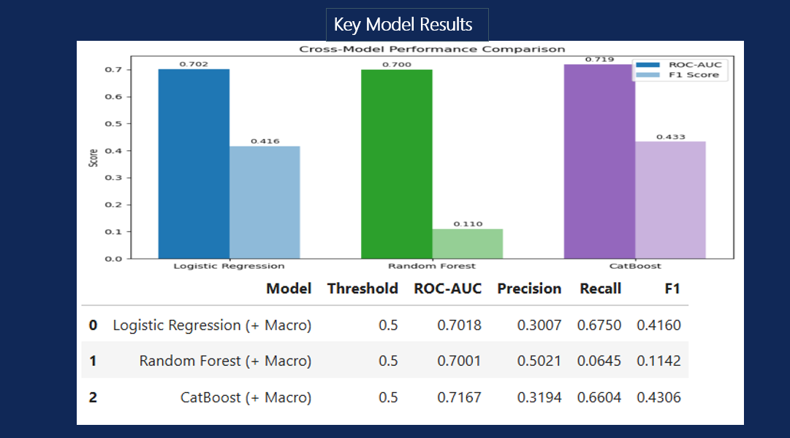
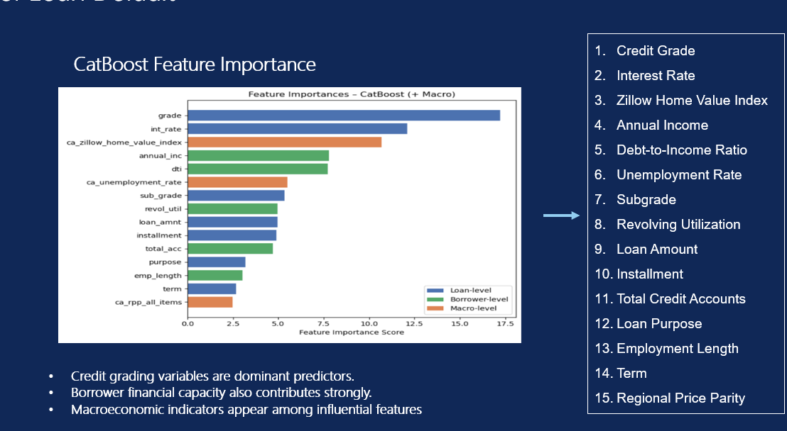
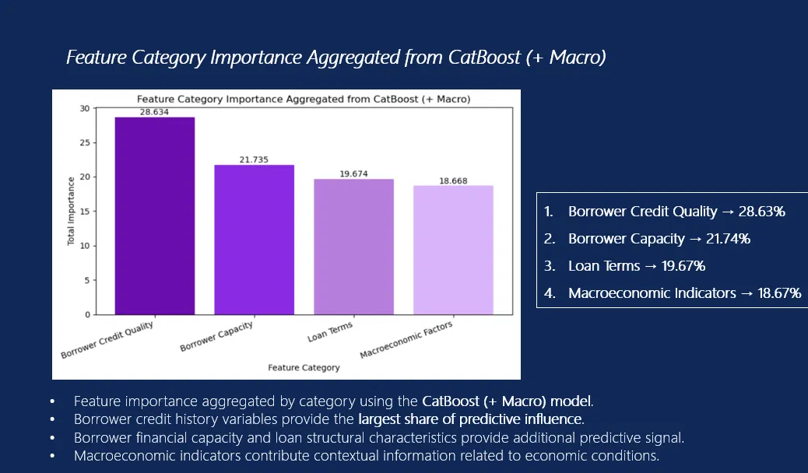

# Loan Default Risk Prediction

Predictive machine learning model to assess consumer loan default risk, built on LendingClub's historical loan data enriched with California macroeconomic indicators. The pipeline covers data auditing, cleaning, California-subset extraction, macro-feature merging, and classification modeling — with CatBoost as the best-performing model at **ROC-AUC 0.717**.

## Data Source

- **Loan data:** LendingClub accepted & rejected loan applications (2007–2018)
- **Macroeconomic data (California):**
  - Unemployment rate
  - Zillow Home Value Index
  - Regional Price Parity (RPP, all items)
- **Original accepted dataset:** 1,369,566 rows × 152 columns
- **Original rejected dataset:** ~27.6 million rows, aggregated to 140 monthly macro records (application volume, avg amount, avg DTI, avg risk score)
- **Target variable:** `target_default` (binary: 0 = no default, 1 = default)
- **Geographic scope:** Filtered to California (`addr_state == "CA"`)

## Notebooks

| Notebook | Milestone | Description |
|---|---|---|
| `01_data_audit_and_understanding.ipynb` | 1 | Data audit — schema review, column classification (ID / Leakage / Predictor / Target) |
| `02_Accepted_Data_Cleaning_Milestone2.ipynb` | 2 | Cleaning accepted loans — dropping ID/leakage columns, missing value handling, one-hot encoding |
| `03_Data_Merging_Milestone3.ipynb` | 3 | California-only extraction, rejected loan aggregation, macroeconomic data integration, feature correlation analysis |
| `04_Modeling_CA_Loan_Default.ipynb` | 4 | Model training and evaluation (Logistic Regression, Random Forest, CatBoost) |

## Methodology

### Milestone 1 — Data Audit
- Classified all 152 raw columns into ID (6), Leakage (38), Predictor (106), and Target categories to prevent data leakage

### Milestone 2 — Cleaning & Encoding
- Dropped ID and leakage columns
- Handled missing data (median imputation for numeric columns, mode for categorical; dropped columns with >50% missing)
- One-hot encoded all categorical variables

### Milestone 3 — California Subset & Macro Feature Integration
- Filtered the cleaned dataset to California-only loans
- Aggregated the raw rejected-loan dataset (~27.6M rows) into monthly macro features
- Cleaned and merged in California unemployment rate, Zillow Home Value Index, and Regional Price Parity by `year_month`
- Ran correlation analysis against `target_default` and reduced to the most predictive features

### Milestone 4 — Modeling
- Trained and evaluated three classifiers: Logistic Regression, Random Forest, and CatBoost — each including the merged macro-level features
- Selected CatBoost as the final model based on ROC-AUC and F1 balance

## Key Results

| Model | ROC-AUC | Precision | Recall | F1 |
|---|---|---|---|---|
| Logistic Regression (+ Macro) | 0.702 | 0.301 | 0.675 | 0.416 |
| Random Forest (+ Macro) | 0.700 | 0.502 | 0.065 | 0.114 |
| **CatBoost (+ Macro)** | **0.717** | 0.319 | 0.660 | 0.431 |



**Best model: CatBoost** — highest ROC-AUC and the strongest precision/recall balance. Random Forest showed higher precision but very poor recall (0.065), meaning it missed most actual defaults, making it unsuitable despite the headline precision number.

## Feature Importance (CatBoost)

Top 15 individual predictors of loan default:

| Rank | Feature | Level |
|---|---|---|
| 1 | Credit Grade | Loan |
| 2 | Interest Rate | Loan |
| 3 | Zillow Home Value Index | Macro |
| 4 | Annual Income | Borrower |
| 5 | Debt-to-Income Ratio | Borrower |
| 6 | Unemployment Rate | Macro |
| 7 | Subgrade | Loan |
| 8 | Revolving Utilization | Borrower |
| 9 | Loan Amount | Loan |
| 10 | Installment | Loan |
| 11 | Total Credit Accounts | Borrower |
| 12 | Loan Purpose | Loan |
| 13 | Employment Length | Borrower |
| 14 | Term | Loan |
| 15 | Regional Price Parity | Macro |



### Feature Category Importance

Aggregating individual feature importances by category:

| Category | Importance Share |
|---|---|
| **Borrower Credit Quality** | 28.63% |
| **Borrower Capacity** | 21.74% |
| **Loan Terms** | 19.67% |
| **Macroeconomic Factors** | 18.67% |



**Key takeaways:**
- Credit grading variables are the dominant predictors of default risk
- Borrower financial capacity (income, DTI, credit utilization) contributes strongly
- Macroeconomic indicators — unemployment rate, home values, and regional price parity — contribute meaningful contextual signal (18.67% of total importance), validating the value of merging external macro data into the model

## Tech Stack

- Python (pandas, NumPy, scikit-learn)
- CatBoost, Random Forest, Logistic Regression
- Google Colab / Jupyter Notebook, Google Drive

## Setup

```bash
pip install -r requirements.txt
```

## Data

Raw data is not included in this repository due to file size and LendingClub's data usage terms. Loan data: LendingClub historical accepted/rejected loans (2007–2018), commonly mirrored on Kaggle. Macroeconomic data: California unemployment statistics, Zillow Home Value Index, and Regional Price Parity from public sources.

## Author

Ghayasudin Ghayas — [LinkedIn](https://linkedin.com/in/ghayasudin-ghayas) | [GitHub](https://github.com/Ghayas0772)
